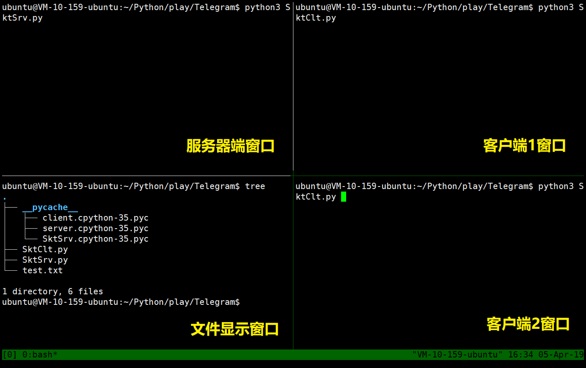
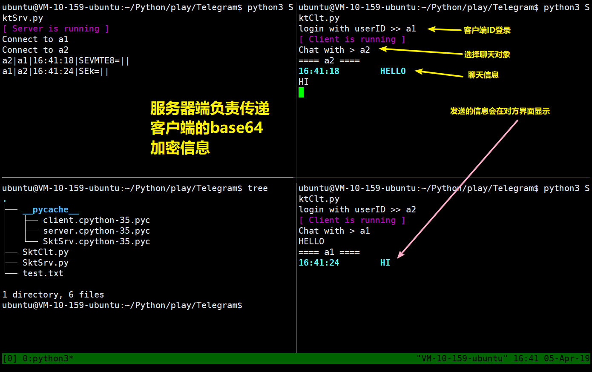
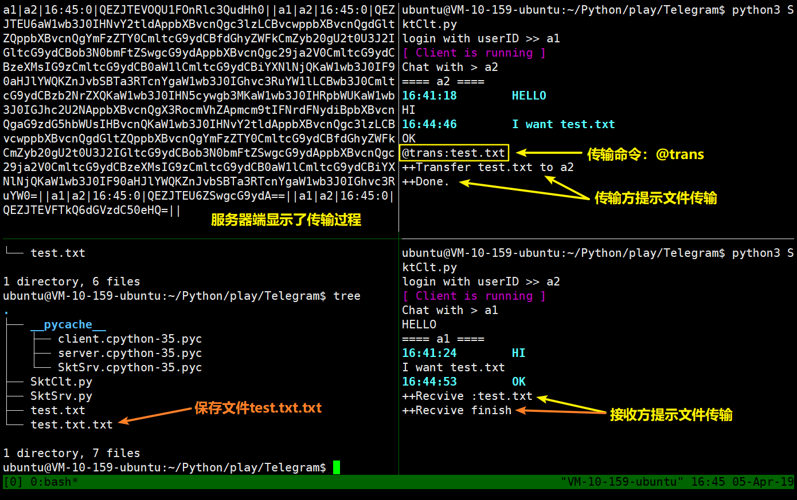

# Telegram
这是一个可以自由切换聊天对象，也能传输文件，还有伪云端聊天信息暂存功能的聊天程序！(￣▽￣)"

> 推荐访问我的[博客](https://randool.github.io/2019/04/10/%E5%9F%BA%E4%BA%8Esocket%E7%9A%84%E7%AE%80%E5%8D%95%E8%81%8A%E5%A4%A9%E7%A8%8B%E5%BA%8F/)，观看效果更佳！

## Naive版聊天程序

最简单的socket通信程序只需要两个进程就可以跑起来了，一个作为服务端，另一个作为客户端，然后两者之间传输数据。

```Python
# Server
import socket
from socket import AF_INET, SOCK_STREAM

serverSocket = socket.socket(AF_INET, SOCK_STREAM)
srv_addr = ("127.0.0.1", 8888)
serverSocket.bind(srv_addr)
serverSocket.listen()

print("[Server INFO] listening...")
while True:
    conn, cli_addr = serverSocket.accept()
    print("[Server INFO] connection from {}".format(cli_addr))
    message = conn.recv(1024)
    conn.send(message.upper())
    conn.close()
```

```Python
# Client
import socket
from socket import AF_INET, SOCK_STREAM

clientSocket = socket.socket(AF_INET, SOCK_STREAM)
srv_addr = ("127.0.0.1", 8888)

print("[Client INFO] connect to {}".format(srv_addr))
clientSocket.connect(srv_addr)

message = bytes(input("Input lowercase message> "), encoding="utf-8")
clientSocket.send(message)

modifiedMessage = clientSocket.recv(1024).decode("utf-8")
print("[Client INFO] recv: '{}'".format(modifiedMessage))
clientSocket.close()
```

## 多用户版

上面这种模式是十分naiive的。比如为了切换用户（假设不同用户在不同的进程上），就只能先kill原先的进程，然后修改代码中的IP和Port，最后花了1分钟时间才能开始聊天。而且这种方式最大的缺陷是只有知道了对方的IP和Port之后才能开始聊天。

为了解决Naiive版聊天程序的缺点，可以构建如下C/S拓扑结构。


这个拓扑的结构的核心在于中央的Server，所有Client的连接信息都会被保存在Server上，Server负责将某个Client的聊天信息转发给目标Client。

### 数据格式设计

像TCP协议需要报文一样，这个简单聊天程序的信息转发也需要Server识别每一条信息的目的，才能准确转发信息。这就需要设计协议报文的结构（显然这是在应用层上的实现）。由于应用场景简单，我是用的协议结构如下：

```
sender|receiver|timestamp|msg
```

这是一个四元组，每个元素用管道符`|`分割。具体来说每个Client（客户进程）发送数据给Server之前都会在`msg`之前附加：发送方标识`sender`、接受方标识`receiver`以及本地时间戳`timestamp`。对应的代码端如下：

```Python
info = "{}|{}|{}|{}".format(self.UserID, targetID, timestamp, msg)
```

这样Server接收到报文之后就能“正确”转发消息了。

> 这里的“正确”被加上了引号，这是为什么？因为在我设计该乞丐版协议的时候简化场景中只存在唯一用户ID的场景，如果有个叫“Randool”的用户正在和其他用户聊天，这个时候另一个“Randool”登陆了聊天程序，那么前者将不能接收信息（除非再次登录）。不过简单场景下还是可以使用的。
>> 解决方法可以是在Client登录Server时添加验证的步骤，让重复用户名无法通过验证。

### 消息队列

该聊天程序使用的传输层协议是TCP，这是可靠的传输协议，但聊天程序并不能保证双方一定在线吧，聊天一方在任何时候都可以退出聊天。但是一个健壮的聊天程序不能让信息有所丢失，由于传输层已经不能确保信息一定送达，那么只能寄希望于应用层。

由于消息是通过Server转发的，那么只要在Server上为每一个Client维护一个消息队列即可。数据结构如下：

``` Python
MsgQ = {}
Q = MsgQ[UserID]
```

使用这种数据结构就可以模拟云端聊天记录暂存的功能了！

### 文件传输

文件传输本质上就是传输消息，只不过文件传输的内容不是直接显示在屏幕上罢了。相比于纯聊天记录的传输，文件传输需要多附加上文件名，

### base64编码传输

普通的聊天信息中不会出现管道符，但是代码和字符表情就不一定了`∑( 口 ||`，如果信息中出现了管道符就会导致协议解析失效，因此需要一种方法将`msg`中的`|`隐藏掉。思路是转义，但是这个需要手工重写协议解析代码，不够美观。由于之前了解过信息安全中的相关知识，还记得有一种编码方式是base64，由于base64编码结果不会出现管道符，那么问题就简单了，只需要用base64将传输信息重新编码一番。并且这是一种“即插即用”的方式，只要自定义base64的编码解码函数，然后嵌套在待发送`msg`的外面即可。

```Python
import base64

b64decode = lambda x: base64.b64decode(x.encode()).decode()
b64encode = lambda x: base64.b64encode(x.encode()).decode()
```

将发送信息改写为如下形式：

```Python
info = "{}|{}|{}|{}||".format(self.UserID, targetID, timestamp, b64encode(msg))
```

### 终端高亮显示

朴素的文字打印在屏幕上难以区分主次，用户体验极差，因此可以使用终端高亮的方法凸显重要信息。在网上查到了一种高亮的方式，但是仅限于Linux系统。其高亮显示的格式如下：

`\033[显示方式;前景色;背景色mXXXXXXXX\033[0m`

中间的`XXXXXXXX`就是需要显示的文字部分了。显示方式，前景色，背景色是可选参数，可以只写其中的某一个；另外由于表示三个参数不同含义的数值都是唯一的没有重复的，所以三个参数的书写先后顺序没有固定要求，系统都能识别；但是，建议按照默认的格式规范书写。

> 这个部分参考了[Python学习-终端字体高亮显示](https://www.cnblogs.com/yangshijia/p/8969271.html)，因此对于参数的配置方面不再多说

### 效果





> 有多种终端分屏插件，这里推荐tmux，上面的分屏效果使用的就是tmux

## P2P版

上面的多用户版聊天程序虽然可以实现灵活的用户切换聊天功能，但是实际上由于所有的数据都会以服务器为中转站，会对服务器造成较大的压力。更加灵活的结构是使用P2P的方式，数据只在Client间传输。应该是将服务器视为类似DNS服务器的角色，只维护一个`Name <--> (IP,Port)`的查询表，而将连接信息转移到Client上。

### 存在的问题

P2P版本的聊天程序并不只是实现上述的功能就可以了，考虑到前边“消息队列”中实现的功能：在用户退出后，聊天信息需要能保存在一个可靠的地方。既然聊天双方都存在退出的可能，那么在这个场景下这个“可靠的地方”就是服务器了。这也就是说P2P版本的Client除了建立与其他Client之间的TCP连接，还需要一直保持和Server的连接！

> 注意这一点，之前是为了减轻Server的压力，减少连接的数量才使用P2P的模式的，但是在该模式为了实现“消息队列”的功能却还是需要Server保存连接。

### 改进方式

如果要进一步改善，可以按照下面的方式：

1. Client C1登录时与Server建立连接，Server验证其登录合法性，然后断开连接。
2. C1选择聊天对象C2，C2的IP等信息需要从Server中获取，因此C1再次建立与Server的连接，完成信息获取后，断开连接。
3. C1与C2的正常聊天信息不通过Server，而是真正的P2P传输。
4. 聊天一方意外断开后（假设为C2），C1传输的信息无法到达，并且C1可以感知到信息无法到达；这个时候C1再次建立与Server的连接，将未能送达的信息保存到Server上的“消息队列”。

补充一点：在步骤2中，如果C2未上线或C2意外断开，由于Server并不能及时知道Client的信息，因此需要“心跳包机制”，Client登录后定时向Server发送`alive`信息，Server收到信息后维持或更新信息。

这样Server从始至终没有一直维持着连接，连接数量是动态变化的，在查询并发量较小的情况下对服务器资源的利用率是很小的。

## 进一步可以思考什么？

如果有多个Server，如何规划Server之间的拓扑？比如Fat-Tree之类的...
